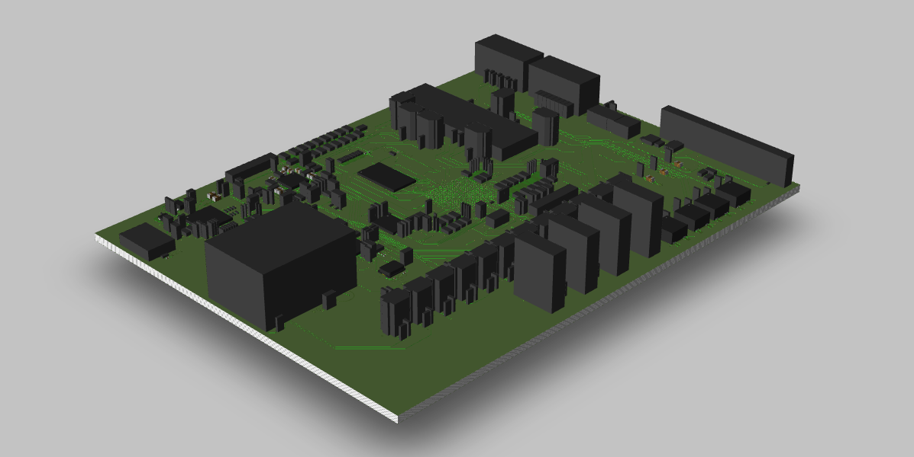
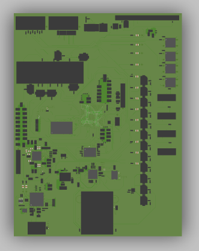
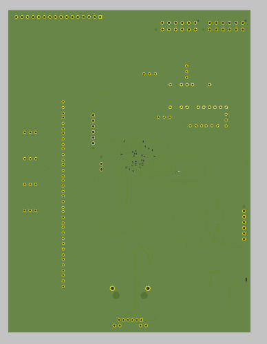
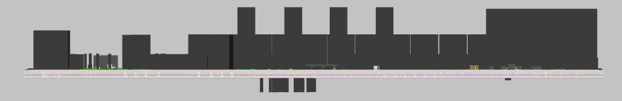
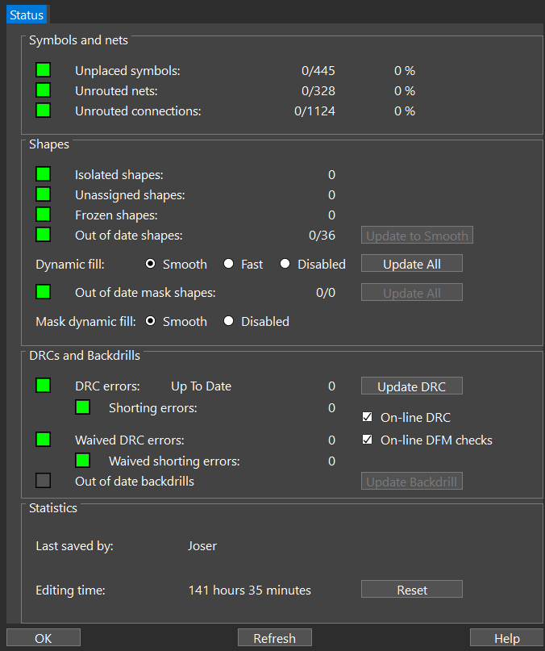
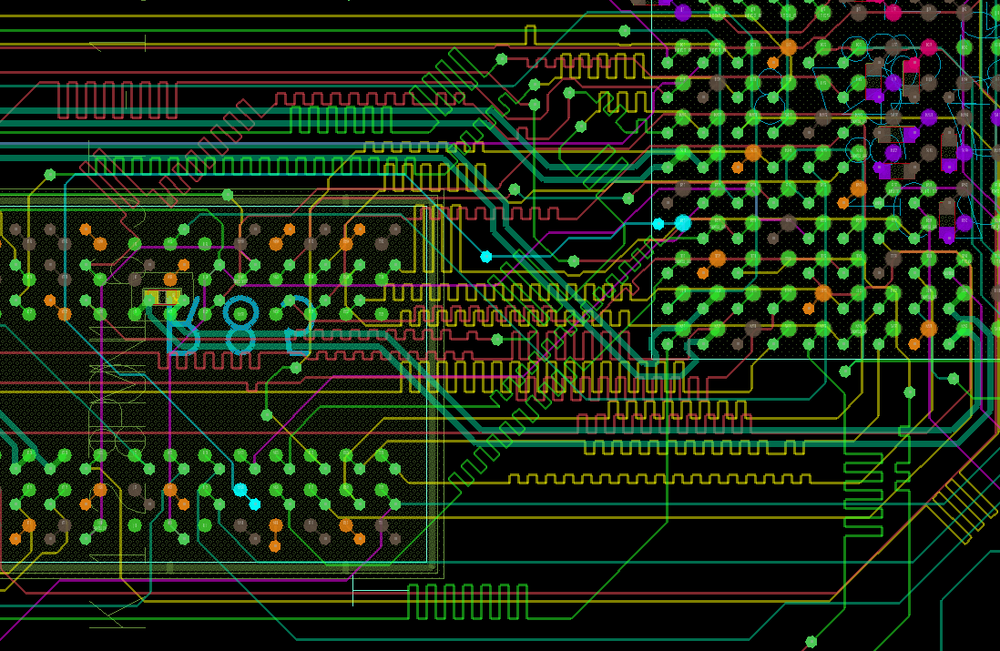

<div align="center">
  
  <h1>FPGA Custom Board — OrCAD PCB Design</h1>
  <p><em>Universidad del Istmo · Facultad de Ingeniería · Diseño Electrónico</em></p>
</div>

---

## Tabla de Contenido

- [Descripción General](#descripción-general)
- [Bases de Diseño](#bases-de-diseño)
- [Render 3D de la PCB](#render-3d-de-la-pcb)
- [Flujo de Diseño — Herramientas Utilizadas](#flujo-de-diseño--herramientas-utilizadas)
- [Esquemático — OrCAD X Capture CIS](#esquemático--orcad-x-capture-cis)
- [Footprint de la PCB](#footprint-de-la-pcb)
- [Periféricos Integrados](#periféricos-integrados)
- [DRC — Design Rule Check](#drc--design-rule-check)
- [Estrategia de Ruteo DDR3 — Delay Tuning](#estrategia-de-ruteo-ddr3--delay-tuning)
- [Filosofía de Vías — Top to Bottom y Tamaño Mínimo](#filosofía-de-vías--top-to-bottom-y-tamaño-mínimo)
- [Descripción de Capas](#descripción-de-capas)
- [Estructura del Proyecto](#estructura-del-proyecto)
- [Fabricación](#fabricación)
- [Notas](#notas)

---

## Descripción General

Este proyecto contiene el diseño completo de una placa PCB personalizada para FPGA, desarrollado en **OrCAD X**. El diseño está basado en un **90% en la arquitectura de la Arty A7** (Digilent), una plataforma de desarrollo FPGA ampliamente utilizada con el chip Xilinx Artix-7. Para el circuito de programación y comunicación UART, se tomó como referencia adicional la **Boolean Board** de Digilent.

El objetivo de esta placa es replicar las funcionalidades esenciales de la Arty A7 en un diseño propio, permitiendo mayor control sobre el hardware y adaptando el layout a los requerimientos específicos del proyecto.

---

## Bases de Diseño

| Referencia        | Contribución al diseño                                      |
|-------------------|-------------------------------------------------------------|
| **Arty A7**       | ~90% del diseño: alimentación, FPGA, memoria, conectores    |
| **Boolean Board** | Circuito de programación (Prog) y comunicación UART         |

---

## Render 3D de la PCB

### Vista General



### Vista Superior (Top)



### Vista Inferior (Bottom)



> En la vista inferior se pueden observar los capacitores de desacoplamiento colocados directamente debajo del FPGA (paquete BGA). Esto se hace de forma intencional para minimizar la **inductancia serie equivalente (ESL)** del PDN (*Power Delivery Network*). Cuando el FPGA conmuta miles de compuertas simultáneamente, genera picos de corriente de alta frecuencia; al colocar los capacitores en la capa inferior, directamente bajo los pines de alimentación del BGA, se logra la trayectoria de corriente más corta posible hacia el plano de tierra, reduciendo la impedancia del PDN y previniendo caídas de voltaje (*voltage droop*) que podrían comprometer la integridad de las señales internas.

### Vista Lateral (Side)



---

## Flujo de Diseño — Herramientas Utilizadas

El diseño siguió el flujo estándar de dos etapas de OrCAD X:

| Etapa        | Herramienta                        | Descripción                                                                 |
|--------------|------------------------------------|-----------------------------------------------------------------------------|
| **Esquemático** | **OrCAD X Capture CIS**         | Captura del esquemático con gestión de componentes mediante el *Component Information System (CIS)*, que permite vincular la base de datos de partes directamente al entorno de diseño para un manejo preciso del BOM y footprints verificados |
| **Layout PCB**  | **OrCAD X PCB Editor Professional** | Editor de PCB con Constraint Manager integrado para gestión de reglas de diseño, delay tuning del DDR3, y ruteo multicapa de alta densidad |

---

## Esquemático — OrCAD X Capture CIS

El esquemático completo fue capturado en **OrCAD X Capture CIS**. Esta herramienta integra el *Component Information System*, permitiendo gestionar los componentes desde una base de datos centralizada, generar el BOM automáticamente y asegurar que todos los símbolos tengan footprints verificados antes de transferir el diseño al PCB Editor.


---

## Footprint de la PCB

La PCB tiene forma rectangular con dimensiones compactas pensadas para integrar la FPGA Artix-7 y sus periféricos. El layout organiza los componentes de la siguiente manera:

- **Centro-derecha**: El chip FPGA Artix-7 como componente principal, rodeado de capacitores de desacoplamiento y circuitería de configuración.
- **Zona superior**: Memoria DDR3, posicionada estratégicamente cerca del FPGA para minimizar la longitud de las trazas y facilitar el delay tuning.
- **Zona de potencia (inferior/lateral)**: Reguladores de voltaje, inductores y capacitores de bulk que alimentan los distintos rieles de la placa (1.0V core, 1.35V DDR3, 1.8V auxiliar, 3.3V I/O).
- **Bordes**: Conectores de expansión (headers) con pines diferenciales, conector USB para programación/UART y pines de acceso de usuario.
- **Periféricos de usuario**: Displays de 7 segmentos integrados directamente en la placa, y un header dedicado para conectar una pantalla LCD externa.

La densidad de componentes es alta, característica inevitable al replicar la arquitectura de la Arty A7 en un form factor propio.

---

## Periféricos Integrados

Además de replicar la funcionalidad base de la Arty A7, la placa incluye los siguientes periféricos propios:

- **Displays de 7 segmentos**: Integrados directamente en la PCB para despliegue numérico sin hardware externo adicional, conectados directamente a los pines I/O del FPGA.
- **Header para LCD**: Conector dedicado para acoplar una pantalla LCD externa, compatible con módulos de pantalla estándar, lo que permite utilizarla como interfaz gráfica de usuario desde la lógica programada en el FPGA.

---

## DRC — Design Rule Check

El diseño fue validado con el **DRC de OrCAD X PCB Editor** obteniendo **0 errores** en todas las categorías verificadas:

- ✅ Clearances (espaciados entre pads, trazas y planos)
- ✅ Short circuits (sin cortocircuitos entre nets)
- ✅ Unconnected pins (sin pines sin conectar)
- ✅ Drill violations (tamaños de taladro dentro de especificación)
- ✅ Silkscreen / courtyard overlaps
- ✅ Net antennae



---

## Estrategia de Ruteo DDR3 — Delay Tuning

El mapeo de la memoria DDR3 al FPGA Artix-7 impone restricciones de **integridad de señal por sincronía temporal**: tanto las líneas de dirección (**Address**) como las de datos (**Data / DQ**) deben llegar al chip de memoria al mismo tiempo para respetar los tiempos de setup y hold del protocolo DDR3.

Para lograr esto se utilizó la técnica de **delay tuning mediante serpentinas** (*meander traces* / *delay tunnels*) en OrCAD X PCB Editor:

- Todas las señales del bus DDR3 (Address, Bank Address, Data, DQS, etc.) fueron compensadas en longitud utilizando **serpentinas de igual retardo**.
- Las serpentinas se agruparon en **match groups**, lo que permite definir una longitud objetivo común y hacer que la herramienta verifique automáticamente que todas las señales del grupo estén dentro de la tolerancia definida.
- Esto garantiza que, aunque las rutas físicas tengan distintos puntos de partida en el FPGA, todas lleguen al DDR3 con el mismo tiempo de propagación.



---

## Filosofía de Vías — Top to Bottom y Tamaño Mínimo

Para simplificar y reducir el costo de fabricación, **todas las vías del diseño son Through-Hole (TOP a BOTTOM)**, es decir, taladros pasantes que atraviesan la totalidad del stack de capas de la PCB. Esto elimina la necesidad de vías ciegas (*blind vias*) o enterradas (*buried vias*), que aumentan el costo al requerir laminaciones múltiples.

Dado que la alta densidad de componentes y la complejidad del ruteo (especialmente en la zona del FPGA y DDR3) dejaban espacios muy reducidos para el trazado, **todas las vías se fabricaron al tamaño mínimo permitido por JLCPCB: 0.08 mm de diámetro de taladro**. Esto fue necesario para poder rutear todas las señales dentro del espacio disponible sin violar las reglas de clearance, especialmente en las capas internas donde conviven planos de tierra, potencia y señales de alta velocidad.

---

## Descripción de Capas

La PCB es un diseño **multicapa** para gestionar correctamente la integridad de señales, los planos de tierra y la distribución de energía de la FPGA.

| Capa             | Tipo       | Descripción                                                                 |
|------------------|------------|-----------------------------------------------------------------------------|
| `TOP`            | Señal      | Capa superior: componentes SMD y trazado de señales principal               |
| `INTERNAL1`      | Señal      | Señales internas de alta velocidad (incluyendo bus DDR3)                    |
| `INTERNAL2`      | Señal      | Señales internas adicionales                                                |
| `INTERNAL3`      | Señal      | Señales internas + **pares diferenciales del header de expansión**          |
| `PWR`            | Potencia   | Plano de distribución de potencia + **pares diferenciales del header**      |
| `3V3`            | Potencia   | Plano dedicado de 3.3V                                                      |
| `GND`            | Tierra     | Plano de tierra principal                                                   |
| `GND0`           | Tierra     | Plano de tierra capa interna 0                                              |
| `GND1`           | Tierra     | Plano de tierra capa interna 1                                              |
| `BOTTOM`         | Señal      | Capa inferior: señales y capacitores de desacoplamiento bajo el FPGA BGA   |

> **Nota sobre INTERNAL3 y PWR:** Estas capas, además de distribución de señales y potencia, alojan los **pares diferenciales** utilizados por el header de expansión, para que las señales diferenciales de alta velocidad tengan una referencia adecuada y menor susceptibilidad a ruido.

---

## Estructura del Proyecto

```
Examen Final/
│
├── ARTY-7/                         # Archivos fuente del diseño en OrCAD X
│   ├── artix-7_ja.brd              # Layout de la PCB (Board file — OrCAD X PCB Editor)
│   ├── artix-7_ja.dsn              # Esquemático del diseño (Design file — OrCAD X Capture CIS)
│   └── arty-a7-e-ja-sch.pdf        # Esquemático exportado en PDF (referencia)
│
├── BOM/                            # Bill of Materials
│   └── ARTIX-7_JA.BOM.xlsx         # BOM completo con todos los componentes
│
├── Cotizacion/                     # Archivos para cotización de manufactura (JLCPCB)
│   ├── COT_ARTY.pdf                # Cotización generada
│   ├── JLCSMT_Sample_CPL1.xlsx     # Centroid / Pick and Place para ensamble SMT
│   └── Sample-BOM_JLCSMT.xlsx      # BOM en formato JLCPCB para cotización
│
├── gerbers/                        # Archivos Gerber para fabricación
│   ├── TOP.art                     # Capa superior
│   ├── BOTTOM.art                  # Capa inferior (incluye caps de desacoplamiento bajo FPGA)
│   ├── GND.art                     # Plano de tierra principal
│   ├── GND0.art                    # Plano de tierra (interna 0)
│   ├── GND1.art                    # Plano de tierra (interna 1)
│   ├── PWR.art                     # Plano de potencia + pares diferenciales
│   ├── 3V3.art                     # Plano de 3.3V
│   ├── INTERNAL1.art               # Señales internas capa 1
│   ├── INTERNAL2.art               # Señales internas capa 2
│   ├── INTERNAL3.art               # Señales internas capa 3 + pares diferenciales
│   └── desktop.ini                 # Archivo del sistema (ignorar)
│
└── Fotos/                          # Capturas y renders de referencia del diseño
    ├── logoUNIS.png                # Logo de la Universidad del Istmo
    ├── ESq.png                     # Captura del esquemático (OrCAD X Capture CIS)
    ├── DRC.png                     # Reporte DRC con 0 errores
    ├── PCB.png                     # Vista completa del layout de la PCB
    ├── Tunnel.png                  # Serpentinas de delay tuning DDR3
    ├── 3DPCB.png                   # Render 3D — vista general de la placa
    ├── 3DTOP.png                   # Render 3D — vista superior
    ├── 3DBOTTOM.png                # Render 3D — vista inferior
    └── 3DSIDE.png                  # Render 3D — vista lateral
```

---

## Fabricación

Los archivos en `gerbers/` y los documentos en `Cotizacion/` están listos para enviarse a **JLCPCB**:

- `JLCSMT_Sample_CPL1.xlsx` → Pick & Place para ensamble SMT
- `Sample-BOM_JLCSMT.xlsx` → BOM en el formato requerido por JLCPCB

---

## Notas

- Los archivos `.brd` y `.dsn` requieren **OrCAD X PCB Editor** / **OrCAD X Capture CIS** (Cadence) para abrirse.
- El esquemático en PDF (`arty-a7-e-ja-sch.pdf`) sirve como referencia visual completa, accesible sin herramientas de EDA.
- El archivo `desktop.ini` dentro de `gerbers/` es generado por Windows y puede ignorarse.
